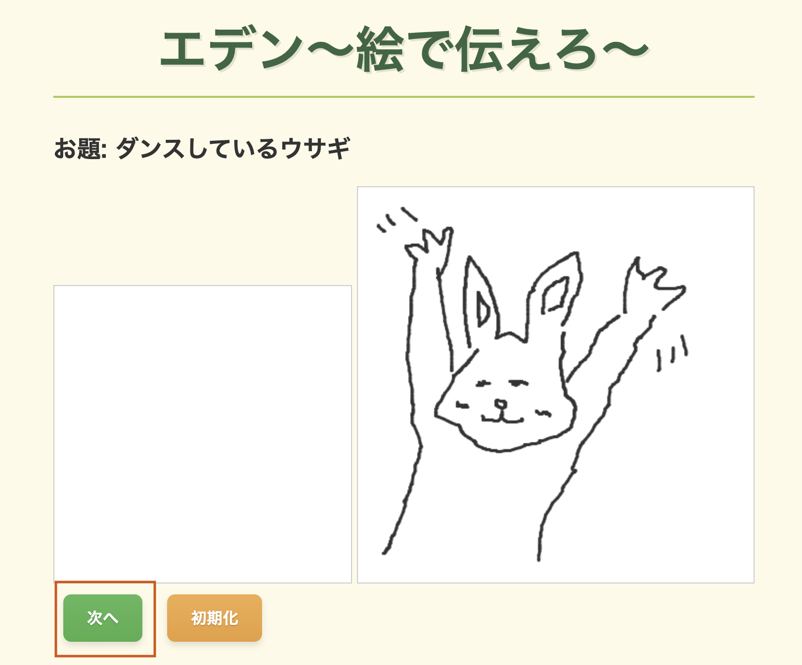
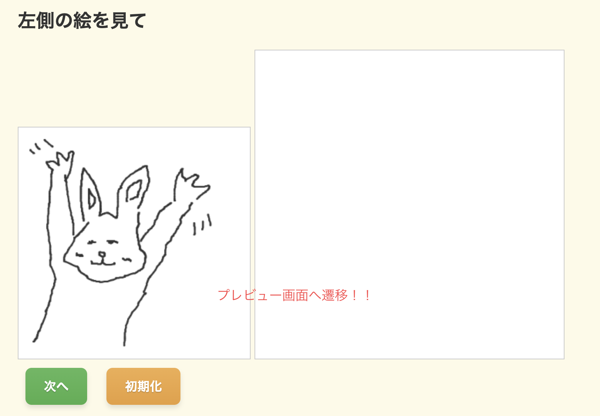

# エデン〜絵で伝えろ〜

## 1.制作物の説明

絵を持ってして相手にお題が何かを伝えるゲーム。
firebase への登録について、文字だけでなく、手書きの絵を保存したいと思いました。

### お題を確認し絵を描く

### 次へを押した時の動作

### 前の人の描いた絵を確認し、また絵を描く。

### 使い方

1. 最初の人は、お題を見て、絵を描く
2. 次の人は、左側のプレビュー画面を見て、絵を描く。
3. 参加人数前 2. を繰り返す。
4. 最後の人は絵を見てお題が何か回答する。

## 2.工夫した点・こだわった点

- firebase 側へ登録した絵をプレビュー側へ表示できること。
- Canvas API の使用
- スマホでも絵を描けるところ

## 3.次回トライしたこと（または機能）

- 最終結果画面の作成。最後に全部の絵がどうだっかを見れる画面も作成。
